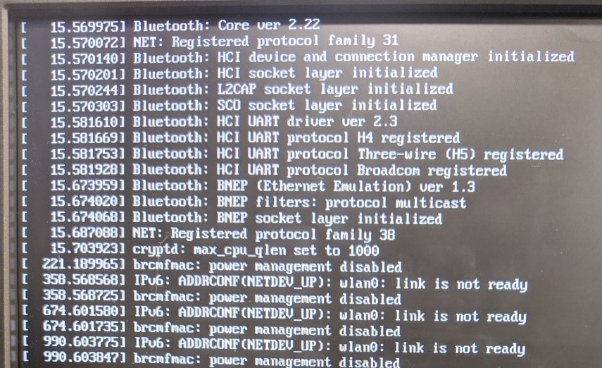

# 라즈베리파이4 활용기
> - 활용 가능한 os는 `Manjaro arm`과 `Raspbian` 2가지가 있는 것으로 확인 됨
> - `Manjaro ARM`은 설치까지는 문제가 없으나, 설치 이후 업데이트 오류가 반복
> - `Manjaro`의 `pacman`이 지원하는 롤링 릴리즈의 강점을 살려, 최대한 아치 리눅스 기반의 환경 구축을 우선시 함 (`Manjaro ARM xfce`)

## 1. `Manjaro ARM` 설치

- Manjaro 설치 자체는 크게 어려울 것이 없음

- https://manjaro.org/download/#arm 에서 KDE, XFCE, Minimal 버전으로 각각 다운로드 가능

- 다운받은 Manjaro는 `Etcher`를 활용하여 sd 카드에 준비하여 라즈베리 파이에 연결 (`Rufus`는 Arch계열 리눅스 설치 때 추가적인 설정이 필요하여 제외)

- 설치 및 기본 세팅은 다음 순서로 진행:

  > 1. 설치 (locale은 ko-kr utf-8로)
  > 2. 한글 폰트 설치 `sudo pacman -S noto-fonts-cjk`
  > 3. 시스템 업그레이드 `sudo pacman -Syu`
  > 4. 한글 입력기 설치 (uim)
  > 5. 파이썬 분석환경 구축 

  1. 설치

     - 설치는 크게 특이사항 없음
     - username, password, timezone 등을 지정해 주면 자동으로 설치
     - 하나 고려할 점은 locale 언어를 한국어로 하고 싶다면 locale을 `ko-kr utf-8`로 지정해 주는 것이 편함

  2. 한글 폰트 설치

     - 위에서 locale을 `ko-kr utf-8`로 지정하면 설치 후 메뉴들이 깨져 보이는 것을 발견할 수 있음
     - 이는 한글 폰트가 없어서 나타나는 현상으로, 폰트만 설치하면 크게 문제없이 활용 가능
     - 폰트는 선택하기 나름이지만, 가독성을 감안하여 noto 서체를 추천
     - 쉘에서 `sudo pacman -S noto-fonts-cjk`를 실행하여 폰트 설치 후  시작메뉴를 눌러보면 한글이 설치된 것을 확인할 수 있음

  3. 시스템 업그레이드

     - 설치 후 각종 패키지를 최신 버전으로 업데이트 진행
     - 업데이트는 `sudo pacman -Syu`로 한번에 가능
     - <del>현재 업데이트 후 `brcmfmac` 에러 반환 후 os 진입이 안되는 현상이 나타나 디버깅이 필요</del> 불안정한 네트워크로 인해 업데이트가 중단되면서 os 진입이 안되는 현상이 발생했었음 (재설치 후 문제 없음)

     

  4. 한글 입력기 설치

     - 한글 입력기는 manjaro와 가장 잘 맞는다는 `uim`을 선택
     - 설치는 `sudo pacman -S uim`으로 진행
     - 설치 후 2가지 설정 필요:
     - `UIM` 세팅:

     > - Application Menu > settings > imput method
     > - Global settings에서: 1)`Specify default IM`체크, 2) `default input metho` `벼루`로 설정, 3) `Enable input methods` 벼루만 남기고 제거 4) `Enable IM switching by hotkey` 체크 해제, 5) `Enable input method toggle by hot keys` 체크 해제
     > - `Byeoru key bindings 1`에서: 1) `Byeoru on`에 한글키 추가, 2) `Byeoru off`에 한글키 추가

     - `xprofile` 세팅:

     > - xprofile 열기
     >
     >   ```shell
     >   sudo nano ~/.xpofile
     >   ```
     >
     > - `xprofile`에 IM 설정
     >
     >   ```
     >   IM="uim"
     >   export GTK_IM_MODULE=$IM
     >   export XMODIFIERS=@im=$IM
     >   export QT_IM_MODULE=$IM
     >   export XIM=$IM
     >   ```
## 2. 사용 환경 구축

  1. 마크다운 에디터 설치
     - arm architecture 지원하는 마크다운 에디터를 찾기 쉽지 않음
     - Typora의 경우 arm에서 지원하지 않으며, ReText는 <del>깃허브 스타일의 마크다운을 보여주지 않아 사용하기 불편</del>ReText의 extension을 활용하여 깃허브 스타일의 마크다운 구현 (https://github.com/retext-project/retext/issues/369)
  2. Python 분석환경 구축

     - `pip`, `jupyter notebook`, `gcloud sdk` 등 python 환경을 구축하려다 보니 몇가지 문제에 맞닥뜨리게 됨
       1. `pip` 를 통해 파이썬 패키지를 관리할 시 `pacman`과 충돌 (`pip` vs `pacman` 누가 버전관리를 할것인가...)
       2. Google Cloud에서 활용하기 어려움 (GCP에서 공식적으로 지원하는 리눅스는 CentOS/Debian/Red Hat/Ubuntu 4종으로 arch 리눅스를 사용시 애로사항이 많을 것으로 예상)
     - 1번 문제는 `pip`를 포기하고 `pacman` (그리고 `aur`)만 사용하는 것으로 대체 (**The right way to install PYTHON packages in ArchLinux**: i.e. `pacman -S python-pandas`)
     - 2번 문제는 수동으로 `google-cloud-sdk`를 설치하거나 `AUR`을 통하는 방식으로 해결 (https://cloud.google.com/sdk/docs/quickstart-linux, https://dev.to/nabbisen/setting-up-google-cloud-sdk-of-gcp-on-archmanjaro-linux-19mk)


- http://blog.naver.com/PostView.nhn?blogId=lecahel&logNo=221719483747 참조하여 초기 세팅 
- https://sensebench.tistory.com/407
- http://www.dorajistyle.pe.kr/2014/04/manjaro-linux.html


## etc. Manjaro 대신 Raspbian 시도

- Rolling Release의 이점 떄문에 여러 난관에도 불구하고 Manjaro를 사용하려 했으나 몇가지 문제로 인해 우분투 계열의 `Raspbian`으로 넘어가기로 결정
  1. `pip` 를 통해 파이썬 패키지를 관리할 시 `pacman`과 충돌 (`pip` vs `pacman` 누가 버전관리를 할것인가...)
  2. Google Cloud에서 활용하기 어려움 (GCP에서 공식적으로 지원하는 리눅스는 CentOS/Debian/Red Hat/Ubuntu 4종으로 arch 리눅스를 사용시 애로사항이 많을 것으로 예상)
  
- `Raspbian`은 우분투 계열 os로 라즈베리에 맞춰져 세팅해 놓았기 때문에 오류가 적을 것으로 예상

- https://rightway-park.tistory.com/3

- 설치 후 한글 세팅은 `sudo apt-get fonts-unfonts-core`로 설정 가능

- https://dgkim5360.tistory.com/entry/basic-setup-of-korean-environment-for-arch-linux

- https://blog.gaerae.com/2014/03/raspberrypi-archlinux-vim.html

  

  

  

## etc. Google Cloud와 Manjaro

- Manjaro는 Google Cloud에서 공식적으로 지원하는 리눅스가 아님
- 몇가지 이유가 있겠지만, 안정성이 주 원인이 아닐까 싶음
- Rolling Release 때문에 도리어 안정성에 해가 되는 경우가 생김 (*I would choose a really stable and not moving distribution without all the bleeding edge component that can break your site at any time.*)
- 
