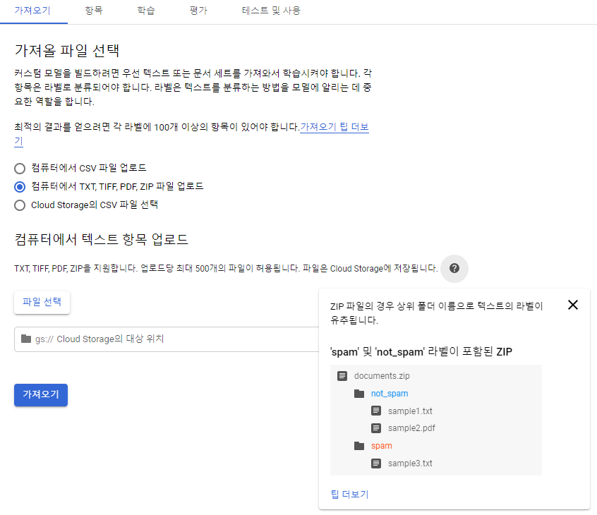

# How to "text analysis'' with Google ML API

> - 통상적으로 텍스트 분석을 수행하는 것은 상당한 수준의 전문 지식, 방대한 량의 학습 데이터, 특정 수준 이상의 컴퓨팅 리소스가 요구됨
> - Google Cloud Platform에서 제공하는 Natural Language(자연어) AutoML을 활용하면 정교한 모델까지는 아니더라도 범용적으로 활용 가능한 모델을 빌드하고 활용할 수 있음

## 1. GCP에서 제공하는 Natural Language 제품

- https://console.cloud.google.com/natural-language/dashboard에서 GCP의 Natural Language 제품을 확인할 수 있음

  

- 통상적인 자연어 분석에서 많이 활용되는, 분류, 감정분석, 항목 추출 기능을 제공

- 모든 AutoML 제품은 Pre-train 된 모델에, 나만의 학습데이터로 fine-tuning하여 맞춤형 모델을 만드는 원리를 따름 (아마 BERT architect 기반으로 추정)

## 2. AutoML 텍스트 및 문서 분류

- text analysis 의 목적이 복수의 카테고리 분류였던 만큼, 분류 모델을 기반으로 설명

- 모델 빌딩을 위해 fine-tuning 하는 과정은 마우스 클릭만으로도 매우 손쉽게 진행

- 과정은 1) 데이터세트를 생성, 2) 데이터를 업로드, 3) 학습 진행 순으로 이루어짐

  > - `데이터 세트` > `새 데이터세트`를 클락하여 새로운 데이터 세트를 생성할 수 있으며 여기서 모델의 목적(y값)을 선택할 수 있음 (다중 항목 분류 선택)
  >
  >   
  >
  > - 데이터 세트가 생성되었으면, 데이터 세트에 파일을 업로드 하여야 함
  >
  > - 이때 요구되는 양식에 맞게 데이터를 업로드 하여야 하는데, 개인적으로 `zip` 파일의 포맷이 제일 쉬웠던 것으로 기억
  >
  >   
  >
  > - `zip`파일의 경우 폴더로 레이블을 분류하고, 각각의 학습용 텍스트가 레이블 폴더 하위에 `txt` 또는 `pdf` 포맷으로 위치하여 있으면 무난히 학습이 가능
  >
  > - 데이터 업로드 후 <학습>탭으로 넘어가서 학습을 실행하면 fine-tuning이 시작되고, 학습이 완료되면 이메일을 통해 알려주게 되니 수시로 확인할 필요는 없음

  ## 3. 커스텀 모델 사용

  - 위의 과정을 거쳐 생성한 커스텀 모델은 console 페이지를 통해 테스트/사용이 가능하며, 실제로 다수의 데이터로 활용하려면 REST API나 Python library를 활용할 필요가 있음

  - 물론 이 과정에서 서비스 AutoML API 사용 및 서비스 계정을 승인할 필요가 있음 (서비스계정 생성 후 서비스키를 내려받아 환경변수로 설정 )

  - 커스텀 모델은 console 페이지를 통해 테스트가 가능하며 아래 예제를 보면 커스텀 모델은 패밀리 할인에 관련된 피드백을 0.74의 점수로 IKEA EVENT에 분류하는 것을 볼 수 있음

    

  - 파이썬 library로 커스텀 모델을 사용하는 방법에 대해서는 아래와 같이 샘플을 제공:

    `실행 스크립트`

    ```shell
    $ python predict.py 'YOUR_SOURCE_FILE' projects/721541100077/locations/us-central1/models/TCN5423015648563298304
    ```

    `predict.py`

    ```python
    import sys
    
    from google.api_core.client_options import ClientOptions
    from google.cloud import automl_v1
    from google.cloud.automl_v1.proto import service_pb2
    
    def inline_text_payload(file_path):
      with open(file_path, 'rb') as ff:
        content = ff.read()
      return {'text_snippet': {'content': content, 'mime_type': 'text/plain'} }
    
    def pdf_payload(file_path):
      return {'document': {'input_config': {'gcs_source': {'input_uris': [file_path] } } } }
    
    def get_prediction(file_path, model_name):
      options = ClientOptions(api_endpoint='automl.googleapis.com')
      prediction_client = automl_v1.PredictionServiceClient(client_options=options)
    
      payload = inline_text_payload(file_path)
      # Uncomment the following line (and comment the above line) if want to predict on PDFs.
      # payload = pdf_payload(file_path)
    
      params = {}
      request = prediction_client.predict(model_name, payload, params)
      return request  # waits until request is returned
    
    if __name__ == '__main__':
      file_path = sys.argv[1]
      model_name = sys.argv[2]
    
    print get_prediction(content, model_name)
    ```

  - 위의 코드를 실행하기 위한 전제 조건으로는 `google-cloud` 라이브러리와 `google-cloud-automl`이 있음

  - 개인적으로는 위의 코드를 그대로 실행하는데 2가지 애로사항이 있었음
  
    > 1) `GOOGLE_APPLICATION_CREDENTIALS`문제가 지속적으로 발생
    >
    > 위의 서비스 계정의 키를 내려받아 환경변수에 등록시켰음에도 불구하고, 지속적으로 `PermissionDenied: 403 The caller does not have permissions...` 오류가 발생
    >
    > 이를 해결하기 위해 코드 내 `GOOGLE_APPLICATION_CREDENTIALS`를 직접적으로 명기함
    >
    > ```python
    > import os
    > os.environ['GOOGLE_APPLICATION_CREDENTIALs'] = '{JSON 파일 위치}'
    > ```
    >
    > 2) 위의 코드는 분류작업을 일일히 하나씩 요청하는 코드로, 다량의 텍스트 분류작업 시 반복 작업이 다소 요구됨
    >
    > 디렉터리 주소를 입력받아, 해당 디렉터리 내 파일을 반복적으로 커스텀 모델에 요청, 결과값들을 `Dictionary/DataFrame`으로 출력하는 함수를 작성하여 해결
    >
    > ```python
    > import re
    > 
    > def get_result(directory=None):
    >     # directory를 입력받아 txt파일을 모두 기록
    >     recomp = re.compile('[.]txt')
    >     flist = os.listdir(directory)
    >     flist = [directory+'/'+i for i in flist if recomp.search(i)]
    >     
    >     # 결과물 dictionary 생성
    >     outcome = {'comment':[], 'cat1':[], 'cat2':[], 'score':[]}
    >     
    > 	# 커스텀 모델에 반복적으로 분류 요청
    >     for file in flist:
    >         tmp = get_prediction(file, 'projects/721541100077/locations/us-central1/models/TCN5423015648563298304')
    >         
    >         # 원문 텍스트 기록
    >         with open(file, 'r', encoding = 'utf-8') as f:
    >                 outcome['comment'].append(re.sub('\ufeff',"",f.read()))
    >         # 카테고리 대분류/소분류 분리
    >         cat = re.findall("[A-Z][^A-Z]*", tmp.payload[0].display_name)
    >         outcome['cat1'].append(cat[0])
    >         outcome['cat2'].append(''.join(cat[1:]))
    >         # 점수 기록
    >         outcome['score'].append(tmp.payload[0].classification.score)
    >                                
    >     return outcome
    > ```
  
    


